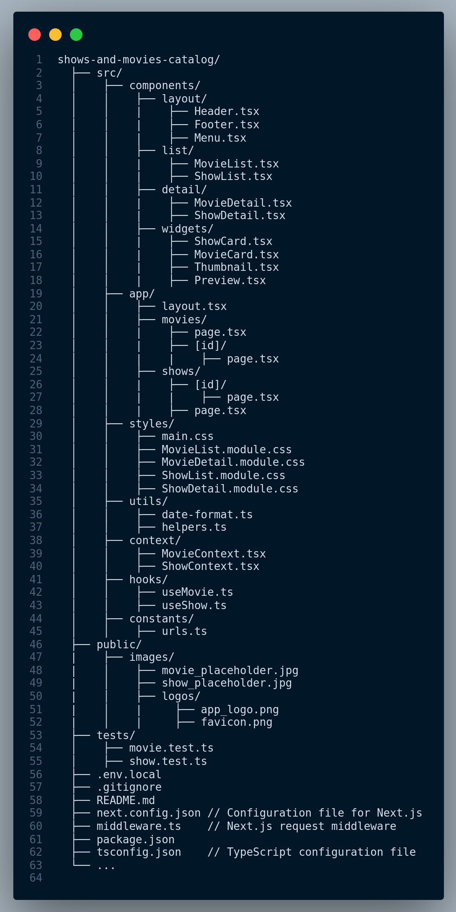

# Micro Frontend: TV Shows and Movies Catalog Folder Structure in Next.js

This repository showcases a well-organized and efficient folder structure for developing a TV shows and movies catalog web application using Next.js. A structured project layout enhances code maintainability and collaboration among developers.

## Inspiration

This repository is a detailed folder structure for one of the Micro frontend in my [Micro-Frontend-for-Streaming-Application](https://github.com/navanathjadhav/Micro-Frontend-for-Streaming-Application) repository.

## Show Your Appreciation ⭐

If you find this project helpful, consider giving it a star ⭐ to show your support. Much appreciated!

## Folder Structure Overview

Take a look at the folder structure diagram below:

## Get a Text Version

Prefer a Text version? Download it [here](./Next.js_Movies_TVshows_Catalog_Folder_Structure.txt).

## Folder Structure

The folder structure is designed to provide a clear separation of concerns and streamline development:

### `src/`

- **components/**: This directory houses reusable UI components, making it easy to maintain and reuse common elements like headers, footers, and widgets throughout your application.

- **app/**: This is an App Router. In version 13, Next.js introduced a new App Router built on React Server Components, which supports shared layouts, nested routing, loading states, error handling, and more. Inside this folder, you'll find components that are specific to your application, including the layout of your web pages and components related to movies and TV shows.

- **styles/**: Store your CSS and module styles here. It includes a global CSS file (`main.css`) and specific style modules for different components, ensuring a consistent and organized styling approach.

- **utils/**: Utility functions that help streamline tasks such as date formatting and general helper functions, making your code more modular and readable.

- **context/**: Context providers for state management within your application. The `MovieContext` and `ShowContext` components help manage movie and show-related data efficiently.

- **hooks/**: Custom hooks that encapsulate complex logic. `useMovie` and `useShow` provide a clean and reusable way to handle movie and show-related functionality.

- **constants/**: Centralized storage for application constants, keeping URLs and other constants organized and easy to update.

### `public/`

- **images/**: Contains image assets for your application, including placeholders for movies and TV shows, ensuring that your content is visually appealing.

- **logos/**: Store your app's logos and icons here, including the app logo and favicon.

### `tests/`

- **movie.test.ts**: Includes tests for movie-related functionality, helping maintain code quality and verify that your application functions as expected.

- **show.test.ts**: Contains tests for show-related functionality, ensuring the reliability of your TV shows and movies catalog application.

### Configuration Files

- `.env.local`: Use this file for local environment variables, making it easy to configure your application for different environments.

- `.gitignore`: A standard Gitignore file to exclude unnecessary files and directories from version control.

- `next.config.json`: The Next.js configuration file, allowing you to customize your Next.js application.

- `middleware.ts`: Includes Next.js request middleware for handling requests in your application.

- `package.json`: The package information file, which lists your project's dependencies and scripts.

- `tsconfig.json`: The TypeScript configuration file, providing TypeScript-specific settings for your project.

## Usage

Use this folder structure as a foundation for your TV shows and movies catalog web application built with Next.js. It simplifies project organization and enhances development efficiency by promoting a modular and maintainable codebase.

## Share and Contribute

Found the project valuable? Share it on [Twitter](https://twitter.com/intent/tweet?url=https://github.com/navanathjadhav/next.js-movies-tvshows-catalog-folder-structure).

## Join the Effort

You're welcome to contribute and enhance this project. Submit a pull request to help create an even richer resource for fellow developers.
